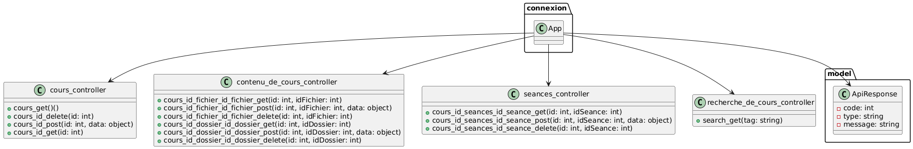

# API système de cours

Mayatta Ndiayre, Killian Marty

## Fonctionnement

Cette API a été générée par "swagger-codegen-cli" à partir du fichier "api.yaml".

Pour le serveur, nous avons implémenté en Python le corps des fonctions liées à chaque endpoint. Les données sont stockées dans le fichier json "swagger_server/cours.json".

Pour les clients Python/Java, nous avons implémenté une interface afin de permettre à l'utilisateur d'intéragir avec l'API (effectuer des requêtes).

## Installation

1. Cloner ce repository git:

```bash
git clone https://github.com/killianmarty/Labo3_architecture_killian_marty
cd Labo3_architecture_killian_marty
```

2. Créer un environnement virtuel Python et installer les dépendances:

```bash
python -m venv .
Scripts\activate
pip install -r requirements.txt
```

## Lancer le serveur

```bash
python -m swagger_server
```

**Précision: le serveur se lance automatiquement sur le port 3000, il faut donc veiller à ce que ce port soit ouvert.**

## Utilisation du load balancer NGINX

Un load balancer NGINX est également à disposition, voici les étapes pour l'utiliser :

1. Modifier la configuration du serveur pour précisier les adresses IP des instances du serveur.

Pour cela, modifier le fichier "nginx-windows/conf/ipadresses.conf". Voici un exemple de syntaxe dans ce fichier (le port utilisé part le serveur de l'API est 3000).

```
server 172.16.13.36:3000;
server 172.16.13.32:3000;
```

2. Lancer NGINX

**Pour lancer NGINX, il est important de se situer dans le dossier "nginx-windows".**

```bash
start nginx
```


## Lancer le client

### Python

```bash
python -m swagger_client
```

### Java

```bash
cd swagger_client_java
javac Main.java
java Main
```

## Utilisation du client

Lors du lancement du client, il sera demander d'indiquer le domaine ainsi que le port. Le format attendu est le suivant:

```
http://adresse_ip:port
```

En cas d'utilisation avec NGINX, l'adresse IP sera celle de la machine qui exécute NGINX, et le port sera 8181.

Le programme proposera ensuite les appels à l'API réalisables.

## Endpoints disponibles

#### Requêtes GET

| Endpoint                                   | Description                                                            |
|--------------------------------------------|------------------------------------------------------------------------|
| `/cours`                                   | Retourne tous les cours                                                |
| `/cours/:idCours?mode=semaine`             | Retourne le contenu d'un cours avec un affichage des séances par semaines |
| `/cours/:idCours?mode=module`              | Retourne le contenu d'un cours avec un affichage des séances par modules |
| `/cours/:idCours/fichier/:idFichier`       | Retourne un fichier d'un cours                                         |
| `/cours/:idCours/dossier/:idDossier`       | Retourne un dossier d'un cours                                         |
| `/cours/:idCours/seances/:idSeance`        | Retourne une séance d'un cours                                         |
| `/search?tag=*`                            | Retourne la liste des cours contenant un tag spécifique                |

### Requêtes POST et DELETE

| Endpoint                                   | Description                                 |
|--------------------------------------------|---------------------------------------------|
| `/cours/:idCours`             | Ajoute/supprime un cours                   |
| `/cours/:idCours/fichier/:idFichier`       | Ajoute/supprime un fichier dans un cours   |
| `/cours/:idCours/dossier/:idDossier`       | Ajoute/supprime un dossier dans un cours   |
| `/cours/:idCours/seances/:idSeance`        | Ajoute/supprime une séance d'un cours      |

## Structure du serveur



Lorsque le serveur (instance de connexion.App) reçoit une requête, il lit le fichier de spécification de l'API (swagger/swagger.yaml) afin de faire une correspondance avec un endpoint défini, et de recupérer le nom de la fonction à appeller. Ces fonctions sont les controllers suivants :

- cours_controller
- contenu_de_cours_controler
- seances_controller
- recherche_de_cours_controller

Elles ont pour rôle d'effectuer les actions souhaités par l'appel à l'API et renvoyer les données demandées. Ce sont ces fonctions que nous avons implémenté nous même.

Puis le serveur renvoie un objet "ApiResponse" qui contient la réponse à renvoyer à l'utilisateur.

## Ce que nous avons appris

Ce laboratoire nous a permis d'apprendre à conçevoir et créer une API avec swagger et à générer un client et un serveur avec swagger-codegen-cli.

Mais nous avons aussi appris à utiliser les environnements virtuels Python, et à lancer le serveur derrière un load balancer.